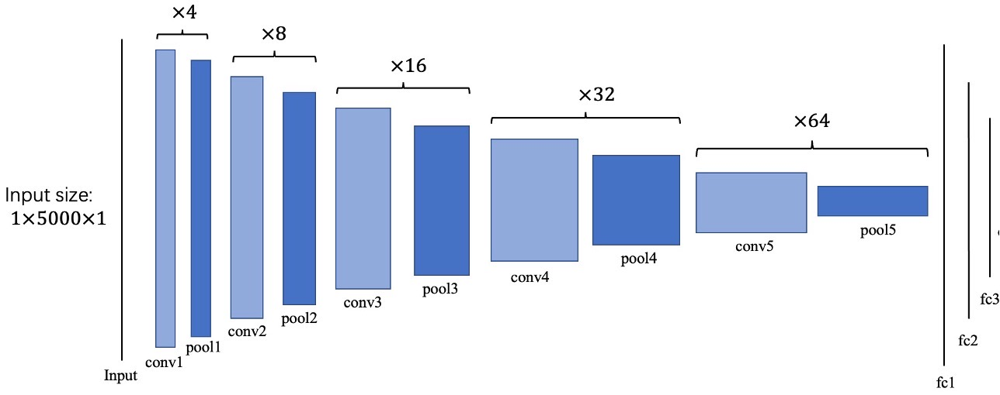
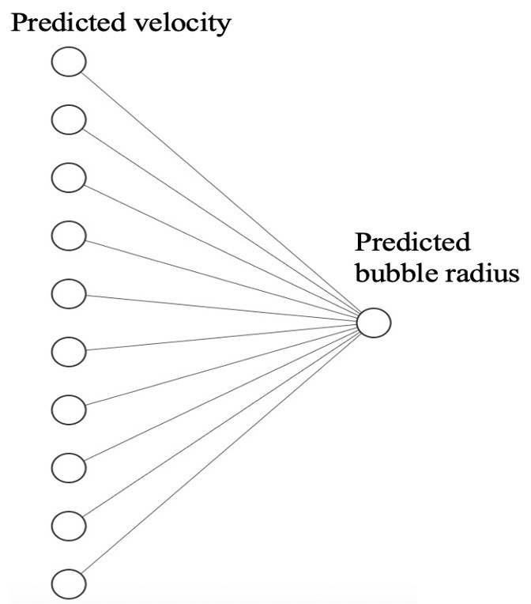
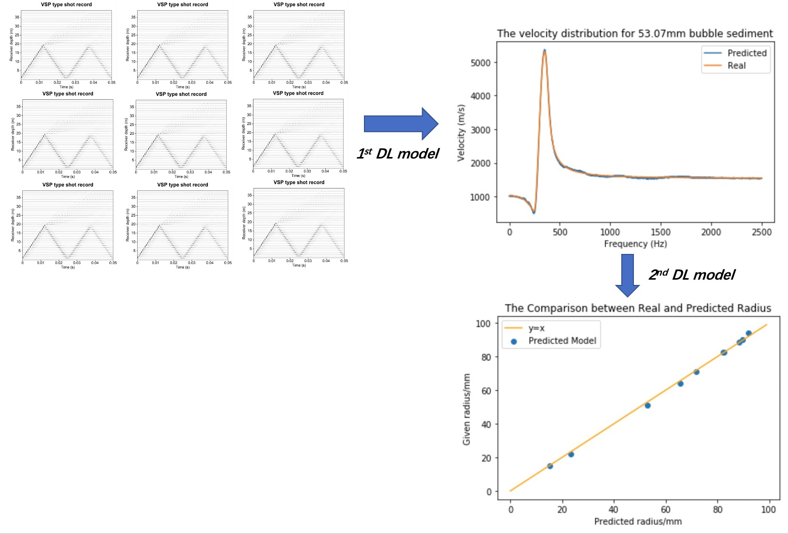

# Velocity_Radius_Inversion_By_DL

This is a supervised learning with deep learning model for velocity and radius inversion in Pytorch.  
There is two stage for whole experiment.  
First stage, a mixed 1D-CNN model to predict velocity curve from raw waveforms.  
Second stage, a simple mlp model to predict radius from predicted velocity in first stage.

## Background

This code is derived from a geophysics research about numercial analysis in gas-charged sediment.  
Acoustic properties of gas-charged sediment is frequency-dependent, which is base theory by Anderson and Hampton.  
The frequency-dependent curve is quite difficult to estimate from raw waveform.  
The first DL model aim to predict frequency-dependent curve from raw waveform.  
Furthermore, the second DL model aim to predict bubble radius from predicted frequency-dependent curve.

## Workflow

This is architecture for velocity inversion model.  
The input is raw waveform in gas-charged sediment, and output is predicted velocity curve.  
The inner structure is a composite of conv-pool block with different number of feature channel.

This is architecture for radius inversion model, which is one-layer mlp.  
Map the predicted velocity to predict bubble radius.

## Dataset

The experiment data is generated by Yang model.
The Data is shared in google drive.
Here is link: https://drive.google.com/file/d/1duAVsiaQe9En_sqRl04jsXc-lpcBXBUt/view?usp=sharing

## Results

## Quick Tour

TKInversion.ipynb is the main file, which includes achievement of two DL model.  
Results_Visulization.ipynb is for visualization of final results.  

Before runnning above two files, there are some points need to check.  
1. PathConfig.py aim to check whether path is corrected for dataset and your main path. Please check 25 and 26 line to match your path.
2. ParamConfig.py aim to check whether super-parameter is corrected for data properties. Please check DataDim, TrainSize, TestSize.

## Environment

Python  = 3.6.12  
Pytorch = 1.7.1  
Numpy   = 1.16.2

# Reference

1.Anderson, A.L., Hampton, L.D., 1980. Acoustics of gas-bearing sediments I-II. J. Acoust. Soc. Am. 67, 1865-1903.
